# Product CRUD API - NestJS

Este é um projeto desenvolvido com NestJS para demonstrar um CRUD de produtos utilizando PostgreSQL e Express (futuramente, irei acrescentar Docker). O projeto já utiliza algumas funcionalidades do Nest.js, como o Guards e o Pipes. O Guards é utilizado para validar o token de autorização, garantindo que a requisição tem permissão para acessar o recurso, enquanto o Pipes é responsável por validar e transformar os DTOs (Data Transfer Objects) do código.

Para não criarmos muita complexidade, utilizei o TypeORM para realizarmos requisições simples no banco sem precisarmos criar linguagens SQL em nosso código. O objetivo deste proeto é fornecer um exemplo bem estruturado de uma API REST para portfólio e aprendizado.

## 🚧 Status
- Em desenvolvimento

## 🚀 Tecnologias Utilizadas

- Node.js com TypeScript
- NestJS (Arquitetura modular e injeção de dependências)
- PostgreSQL (Banco de dados relacional)
- TypeORM (Facilitador de comunicação com o banco de dados de forma orientada a objetos)
- Jest (Testes unitários)

## 📌 Funcionalidades

- Criar um produto
- Listar todos os produtos por paginação
- Buscar um produto por ID
- Atualizar um produto
- Deletar um produto

## 🛠️ Como Configurar o Projeto

- Clone o repositório: https://github.com/GiovanniOrnelas/product-crud-nestjs.git
- Instale as dependências: npm install
- Crie o .env com as informações:
    ## API
    API_AUTHORIZATION = ''

    ## PostgreSQL
    BD_USER = ''
    BD_PASSWORD = ''
    BD_PORT = 
    BD_NAME = ''
- Configure o banco de dados PostgreSQL em seu ambiente local
- Inicie o servidor: npm run start

## ⚡ Exemplos de Endpoints

- Criar um Produto

    curl 'http://localhost:3000/api/product' \
    -H 'Authorization: Basic {{Token}}' \
    -H 'Content-Type: application/json' \
    -d '{
        "ean": "",
        "name": "product-name",
        "unit": "kg || un",
        "stock": 0
    }'

## 🧪 Testes Unitários

- Crie o script no seu package.json

    "scripts": {
        "start": "nest build && node dist/main",
        "test:controller": "jest src/product.controller.spec.ts",
        "test:repository": "jest tests/repository.spec.ts"
    }

- Para rodar os testes, execute: npm run <script_name>

## 📖 Documentação com Swagger

- O projeto utiliza Swagger para fornecer uma interface interativa da API. Para acessar a documentação:

    1. Inicie o servidor: npm run start
    2. Acesse http://localhost:3000/api no navegador.

## 🖼️ Prints do Projeto

- Aqui estão alguns prints da execução dos testes da API:

## Criar Produto

| Status Code        | Descrição                  | Imagem                                                               |
|--------------------|----------------------------|----------------------------------------------------------------------|
| 201 Created        | Produto criado com sucesso | 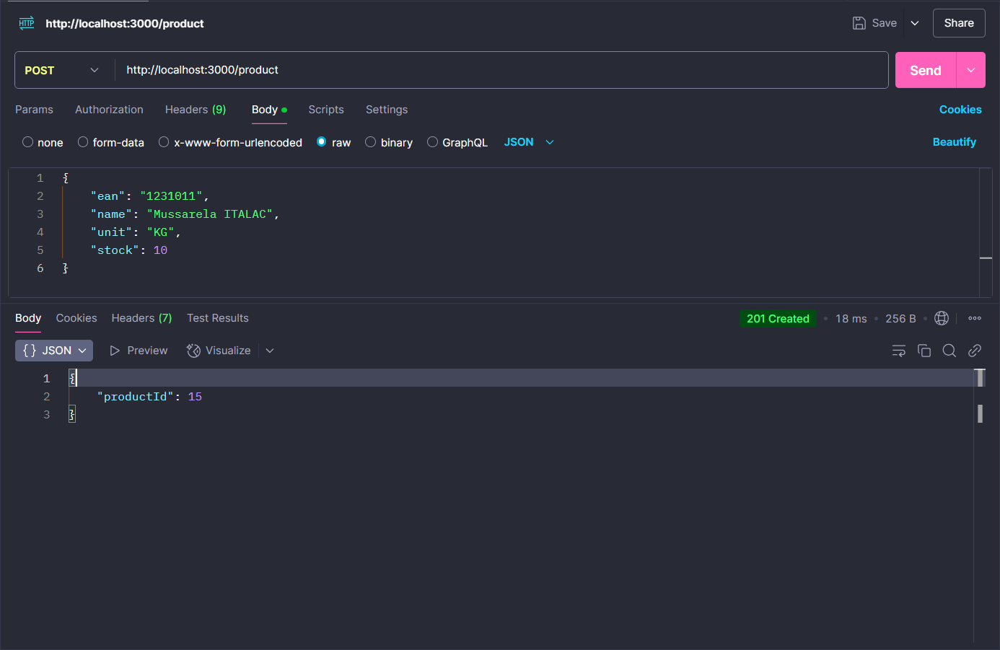             |
| 400 Bad Request    | Produto já existente         | 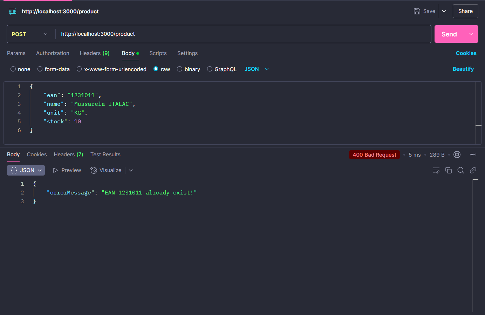   |
| 400 Bad Request    | Campos obrigatórios faltando (ValidationPipe)         | 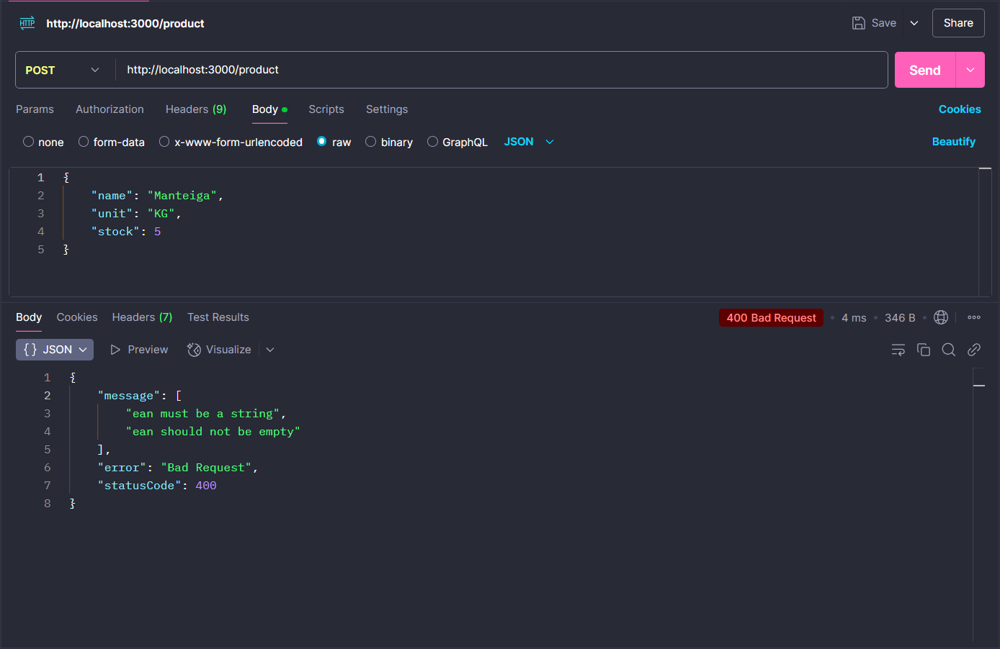   |
| 401 Unauthorized   | Não autorizado. Token inválido!             | 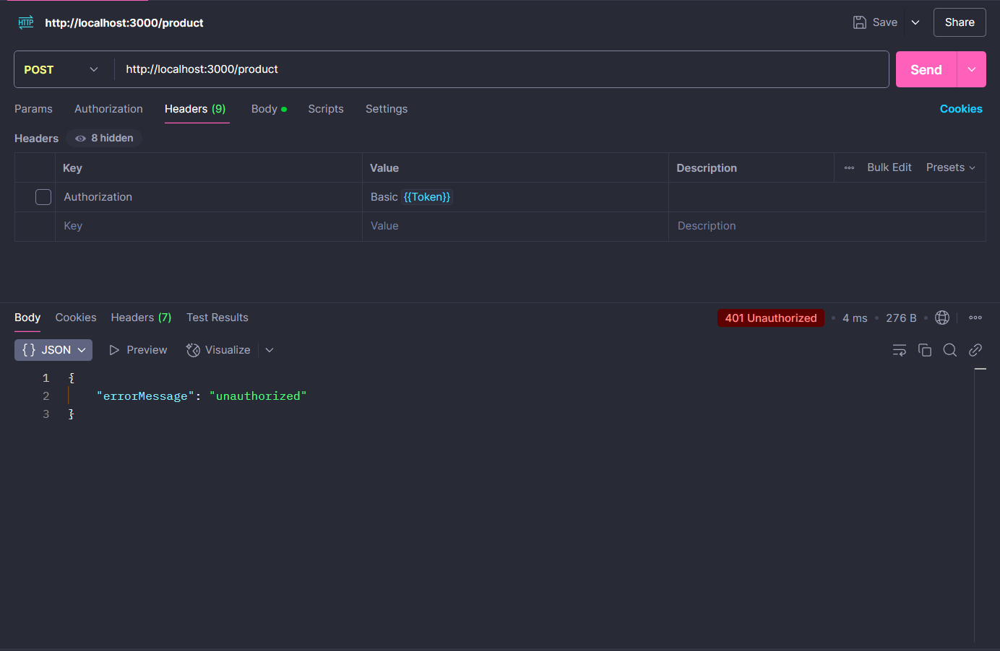 |

## Buscar Produto

| Status Code        | Descrição                  | Imagem                                                             |
|--------------------|----------------------------|--------------------------------------------------------------------|
| 200 OK             | Produto encontrado         | 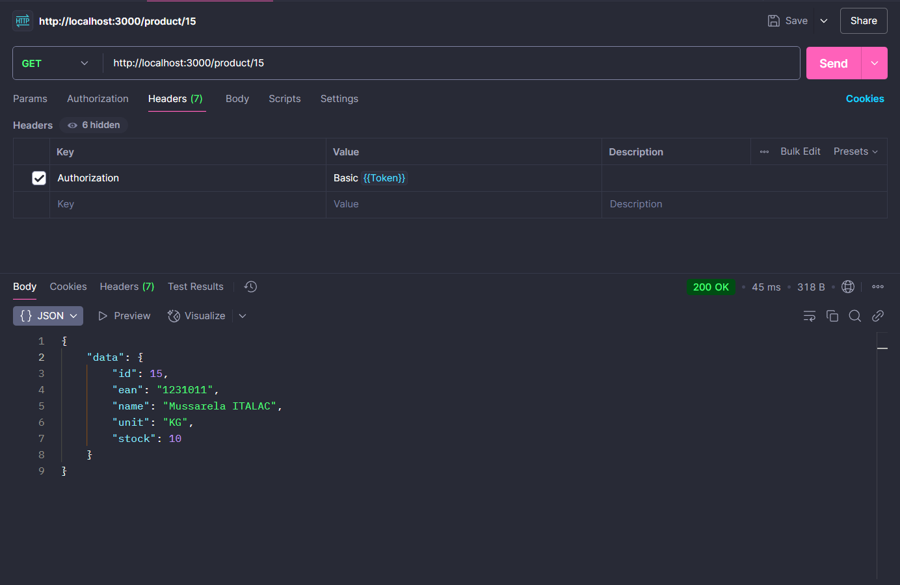                     |
| 400 Bad Request    | Produto não existe        | 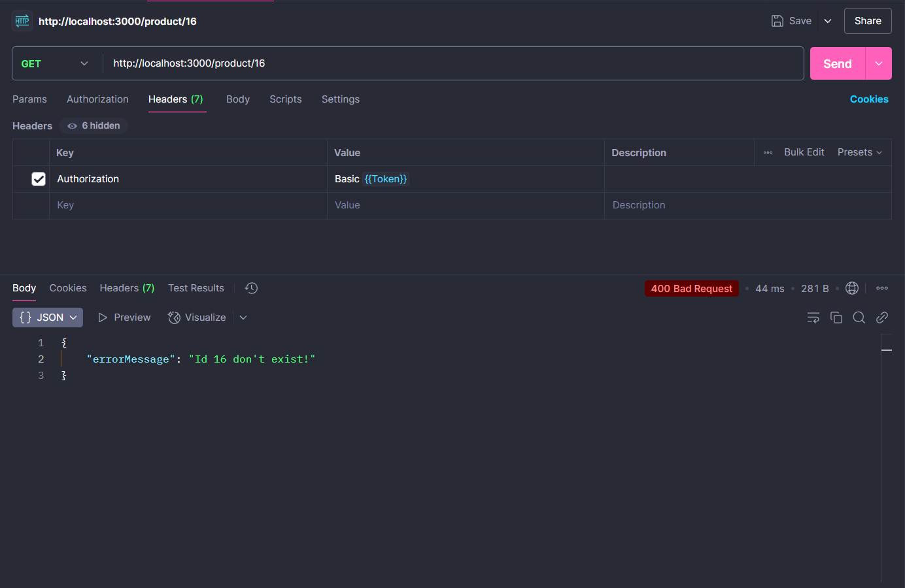   |
| 401 Unauthorized   | Não autorizado. Token inválido!             | 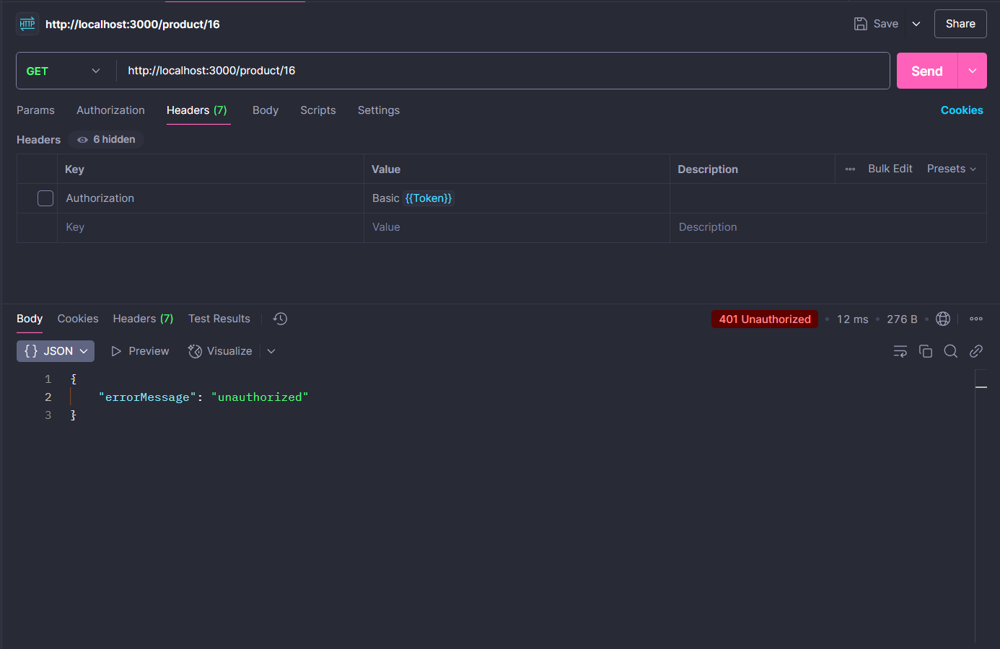 |

## Atualizar Produto

| Status Code        | Descrição                  | Imagem                                                             |
|--------------------|----------------------------|--------------------------------------------------------------------|
| 200 OK             | Produto atualizado         |        |
| 400 Bad Request    | Produto não existe        | 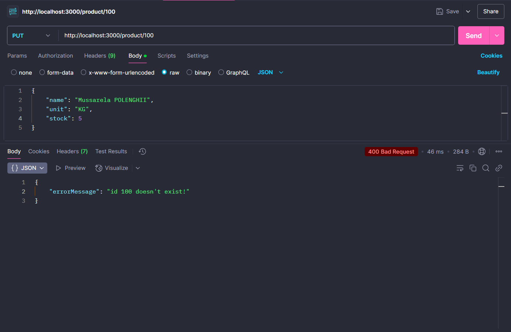   |
| 400 Bad Request    | Campos obrigatórios faltando (ValidationPipe)         | 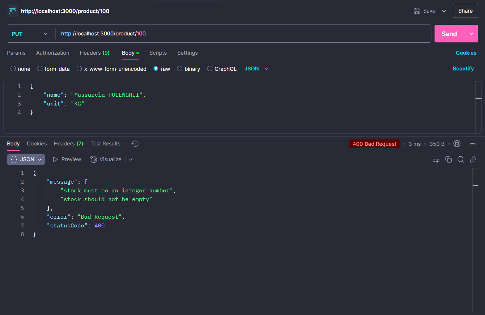   |
| 401 Unauthorized   | Não autorizado. Token inválido!        | 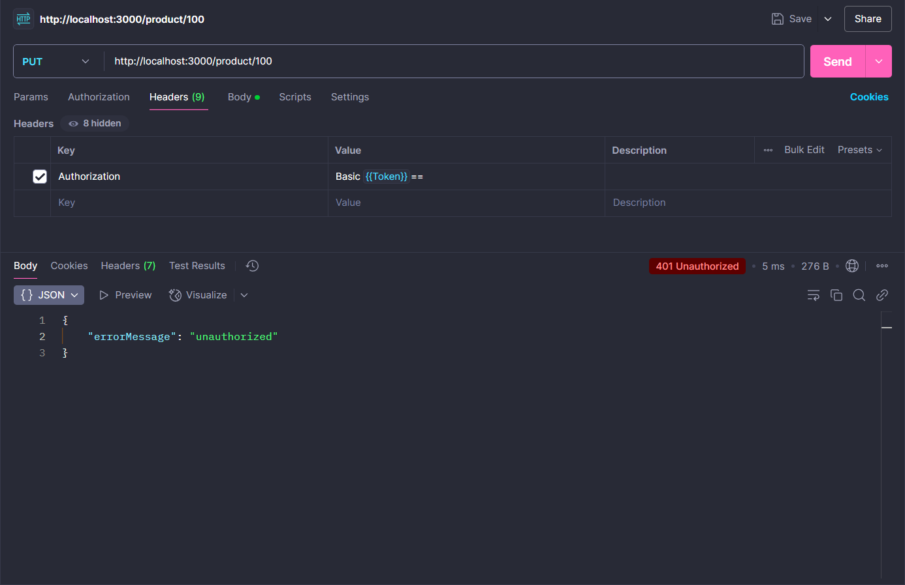 |

## Deletar Produto

| Status Code        | Descrição                  | Imagem                                                            |
|--------------------|-------------------------|----------------------------------------------------------------------|
| 204 No Content     | Produto deletado        |                      |
| 400 Bad Request    | Produto não existe      | 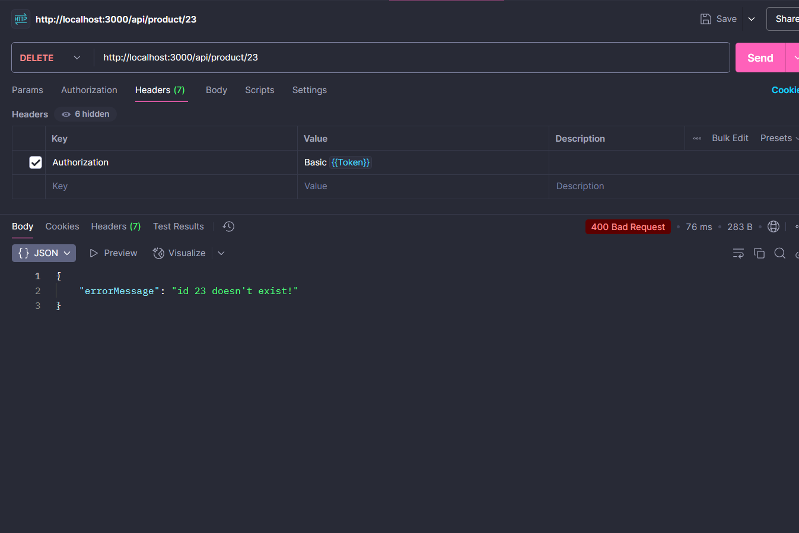 | |
| 401 Unauthorized   | Não autorizado. Token inválido!        | 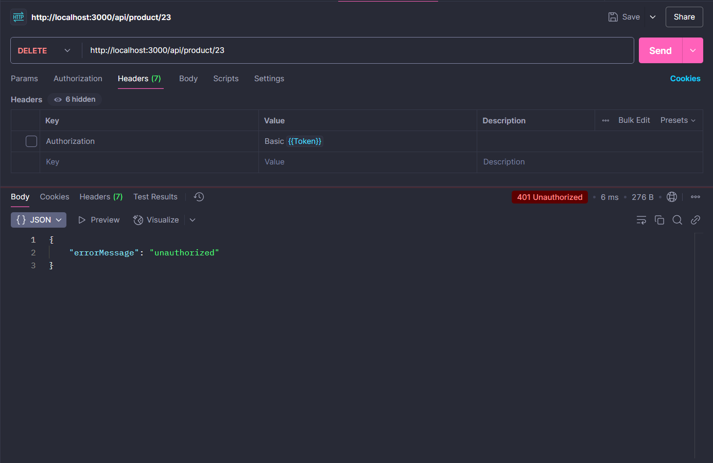 |

## Diagrama Sequencial do Projeto

Link: https://miro.com/welcomeonboard/ZGJETVQ3dWhGbCs3ZUxudkExREdRMjczRW10bjdISXNnaVlMRXJEUDUyOWJjdjZ3bUY0S3JUc0lYVWYxL211UjlNZFZ1NVU3WEo4NFo2UFhyWG1uaHNDeXkxbE9CZDVaRlFuOGo4VnFUbEkzWE9mSCs5TUNiTUxEdGdXMm85dTZBd044SHFHaVlWYWk0d3NxeHNmeG9BPT0hdjE=?share_link_id=243994257622